# RESULTS

# KOI Score Distribution

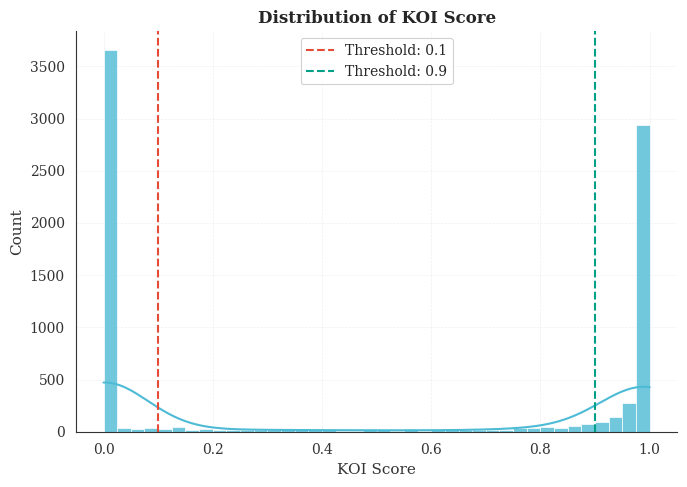

*Distribution_of_KOI_score.png*

**Summary Statistics**

```jsx
count    7994.000000
mean        0.483829
std         0.477009
min         0.000000
25%         0.000000
50%         0.371000
75%         0.999000
max         1.000000
```

**After Applying Thresholds**

```jsx
Labeled samples: 7211
Label distribution (0=low quality, 1=high quality):
quality_label
0    3753
1    3458
Name: count, dtype: int64
```

---

# Exploratory Data Analysis

### Feature Transformations

**Log₁₀ transformation**

- `koi_period`, `koi_duration`, `koi_prad`, `koi_teq`, `koi_insol`, `koi_srad`

**Log₁₀(1+x) transformation**

- `koi_depth`, `koi_model_snr`

**Linear (no transformation)**

- `koi_impact`, `koi_steff`, `koi_slogg`, `koi_kepmag`

### Feature Distribution Boxplots

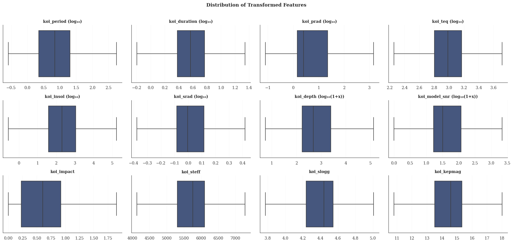

*Distribution_of_Transformed_Features.png*

---

# Correlation Analysis

### Pre-PCA Correlation Matrix (X₁₂)

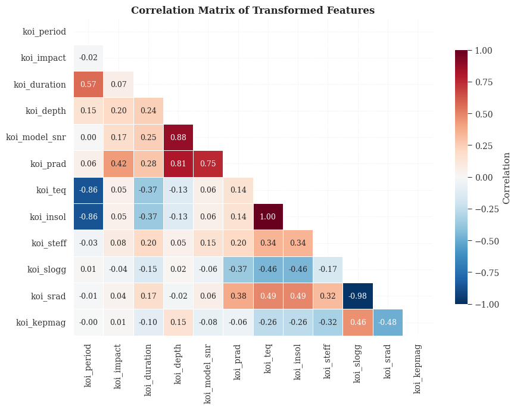

*Correlation_Matrix_of_Transformed Features.png*

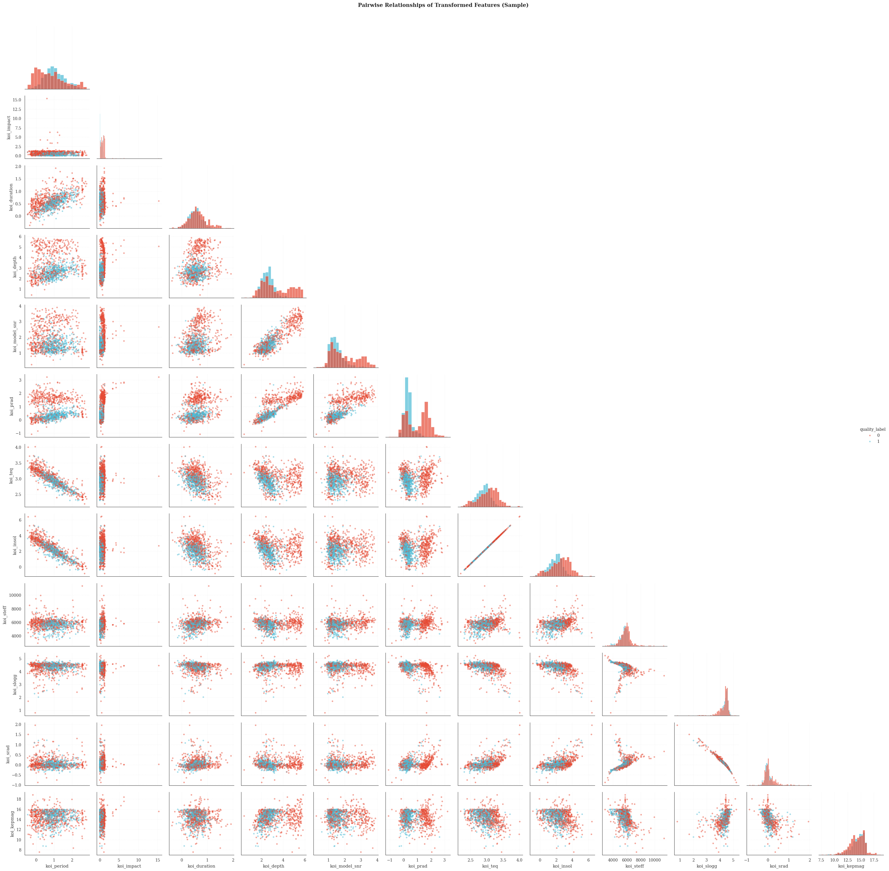

*Pairplot_of_Transformed_Features.png*

---

# Principal Component Analysis

### Eigenvalue Decomposition

**Explained variance by component:**

```jsx
            eigenvalue  explained_%  cumulative_%
PC1          3.737318        31.14         31.14
PC2          2.971272        24.76         55.90
PC3          2.111366        17.59         73.49
PC4          0.994332         8.29         81.78
PC5          0.926532         7.72         89.50
PC6          0.646095         5.38         94.88
PC7          0.439769         3.66         98.54
PC8          0.115413         0.96         99.51
PC9          0.052262         0.44         99.94
PC10         0.006205         0.05         99.99
PC11         0.000935         0.01        100.00
PC12         0.000001         0.00        100.00
```

<aside>

**Key Insight:** The first 3 principal components capture 73.49% of the total variance, suggesting strong dimensional reduction potential.

</aside>

### Loading Matrix

**Eigenvector matrix A (feature contributions to each PC):**

$$
\tiny
\mathbf{A} = \left[\begin{array}{rrrrrrrrrrrr}
-0.31 & 0.30 & 0.39 & -0.02 & 0.04 & 0.01 & -0.31 & -0.11 & -0.05 & 0.04 & 0.74 & 0.00 \\
0.08 & 0.19 & -0.16 & -0.09 & 0.92 & -0.15 & 0.06 & -0.20 & 0.11 & 0.00 & 0.00 & 0.00 \\
-0.09 & 0.36 & 0.31 & 0.22 & 0.02 & 0.32 & 0.78 & 0.08 & 0.08 & 0.01 & 0.00 & 0.00 \\
0.05 & 0.47 & -0.33 & -0.04 & -0.23 & -0.01 & -0.15 & 0.08 & 0.76 & 0.03 & 0.01 & 0.00 \\
0.15 & 0.43 & -0.31 & 0.11 & -0.28 & -0.22 & 0.11 & -0.62 & -0.41 & -0.01 & -0.01 & 0.00 \\
0.23 & 0.47 & -0.17 & -0.16 & 0.06 & 0.05 & -0.13 & 0.67 & -0.46 & -0.01 & 0.00 & 0.00 \\
0.47 & -0.20 & -0.15 & 0.05 & -0.02 & 0.11 & 0.14 & 0.01 & 0.05 & 0.03 & 0.42 & -0.71 \\
0.47 & -0.20 & -0.15 & 0.05 & -0.02 & 0.11 & 0.14 & 0.01 & 0.05 & 0.03 & 0.42 & 0.71 \\
0.22 & 0.09 & 0.13 & 0.78 & 0.13 & 0.29 & -0.41 & -0.04 & 0.00 & -0.13 & -0.17 & 0.00 \\
-0.36 & -0.10 & -0.38 & 0.40 & 0.05 & -0.10 & 0.07 & 0.17 & -0.08 & 0.70 & 0.13 & 0.00 \\
0.38 & 0.11 & 0.39 & -0.26 & -0.02 & 0.16 & -0.15 & -0.18 & 0.03 & 0.70 & -0.23 & 0.00 \\
-0.24 & -0.03 & -0.35 & -0.25 & 0.05 & 0.83 & -0.11 & -0.21 & -0.11 & -0.01 & 0.00 & 0.00
\end{array}\right]_{12 \times 12}
$$

*Rows: koi_period, koi_impact, koi_duration, koi_depth, koi_model_snr, koi_prad, koi_teq, koi_insol, koi_steff, koi_slogg, koi_srad, koi_kepmag*
*Columns: PC1 through PC12*

### Top Contributors by Component

- **PC1** (31.14% variance): `koi_teq`, `koi_insol`, `koi_srad`, `koi_slogg`, `koi_period`
- **PC2** (24.76% variance): `koi_depth`, `koi_prad`, `koi_model_snr`, `koi_duration`, `koi_period`
- **PC3** (17.59% variance): `koi_srad`, `koi_period`, `koi_slogg`, `koi_kepmag`, `koi_depth`

### Visualizations

**Scree Plot and Pareto Plot (Cumulative Variance)**

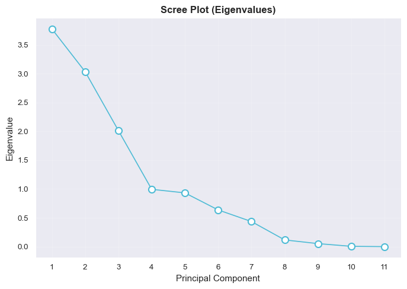

*ScreePlot.png*

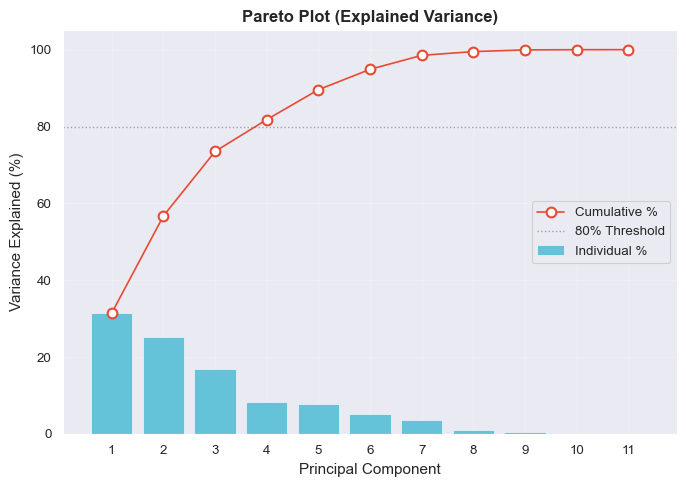

*ParetoPlot.png*

**Biplot**

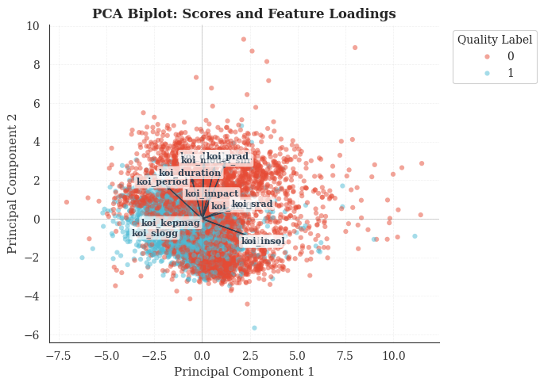

*PCA_Biplot.png*

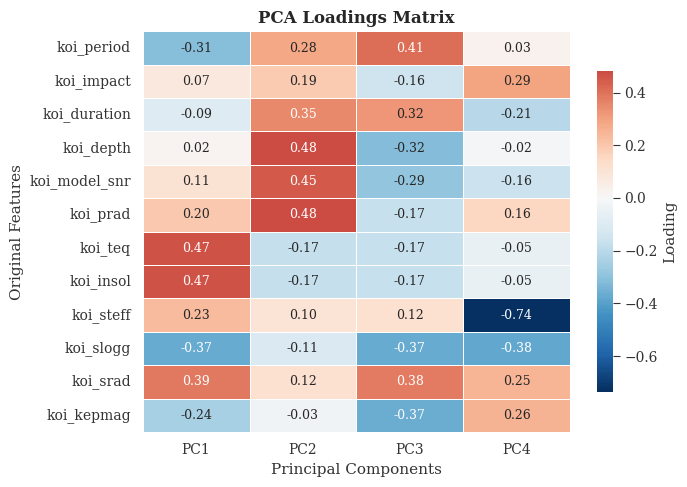

*PCA_Score_Plot.png*

**Loadings Heatmap**

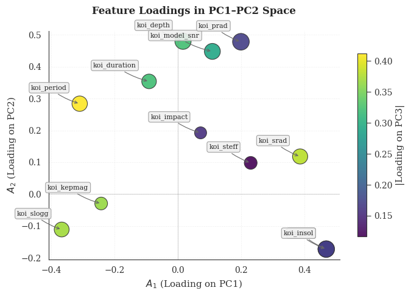

*Feature_Loadings_Plot.png / PCA_Loading_Matrix.png*

---

# Model Comparison

### Models on Original Features (12-D)

```
                                Model  Accuracy     AUC  Recall   Prec.      F1   Kappa     MCC  TT (Sec)
lightgbm  Light Gradient Boosting Machine    0.8841  0.9509  0.9024  0.8627  0.8819  0.7682  0.7692     0.054
gbc          Gradient Boosting Classifier    0.8804  0.9445  0.9049  0.8544  0.8788  0.7609  0.7623     0.096
rf               Random Forest Classifier    0.8769  0.9440  0.8817  0.8646  0.8729  0.7535  0.7539     0.048
et                 Extra Trees Classifier    0.8747  0.9428  0.8920  0.8535  0.8722  0.7493  0.7502     0.024
knn                K Neighbors Classifier    0.8677  0.9235  0.9003  0.8366  0.8672  0.7358  0.7380     0.011
ada                  Ada Boost Classifier    0.8620  0.9245  0.8925  0.8322  0.8612  0.7244  0.7264     0.025
lda          Linear Discriminant Analysis    0.8058  0.8619  0.9334  0.7344  0.8218  0.6151  0.6372     0.003
ridge                    Ridge Classifier    0.8055  0.8624  0.9329  0.7344  0.8216  0.6146  0.6366     0.002
lr                    Logistic Regression    0.8137  0.8668  0.8889  0.7627  0.8207  0.6292  0.6380     0.004
qda       Quadratic Discriminant Analysis    0.7917  0.9003  0.9390  0.7158  0.8122  0.5877  0.6156     0.002
dt               Decision Tree Classifier    0.8164  0.8161  0.8088  0.8088  0.8083  0.6322  0.6329     0.007
svm                   SVM - Linear Kernel    0.7902  0.8458  0.8435  0.7524  0.7940  0.5818  0.5882     0.005
nb                            Naive Bayes    0.7756  0.8766  0.8977  0.7109  0.7933  0.5550  0.5735     0.004
dummy                    Dummy Classifier    0.5204  0.5000  0.0000  0.0000  0.0000  0.0000  0.0000     0.002
```

### Models on PCA Features (4 PCs)

```
                                Model  Accuracy     AUC  Recall   Prec.      F1   Kappa     MCC  TT (Sec)
lightgbm  Light Gradient Boosting Machine    0.8063  0.8802  0.8274  0.7822  0.8039  0.6128  0.6143     0.042
rf               Random Forest Classifier    0.8093  0.8844  0.8099  0.7964  0.8028  0.6181  0.6187     0.040
gbc          Gradient Boosting Classifier    0.8023  0.8723  0.8243  0.7775  0.8000  0.6049  0.6063     0.043
et                 Extra Trees Classifier    0.8036  0.8868  0.8130  0.7858  0.7989  0.6070  0.6077     0.025
knn                K Neighbors Classifier    0.8033  0.8704  0.8063  0.7894  0.7974  0.6064  0.6069     0.008
ada                  Ada Boost Classifier    0.7865  0.8556  0.8239  0.7543  0.7874  0.5738  0.5763     0.017
qda       Quadratic Discriminant Analysis    0.7550  0.8594  0.9122  0.6833  0.7812  0.5156  0.5440     0.002
nb                            Naive Bayes    0.7610  0.8463  0.8512  0.7092  0.7736  0.5249  0.5351     0.003
ridge                    Ridge Classifier    0.7518  0.7956  0.8651  0.6937  0.7698  0.5075  0.5227     0.002
lda          Linear Discriminant Analysis    0.7518  0.7956  0.8651  0.6937  0.7698  0.5075  0.5227     0.002
lr                    Logistic Regression    0.7473  0.7945  0.8248  0.7012  0.7578  0.4973  0.5050     0.003
svm                   SVM - Linear Kernel    0.7406  0.7862  0.8124  0.6989  0.7484  0.4836  0.4952     0.004
dt               Decision Tree Classifier    0.7404  0.7399  0.7283  0.7308  0.7289  0.4799  0.4807     0.004
dummy                    Dummy Classifier    0.5204  0.5000  0.0000  0.0000  0.0000  0.0000  0.0000     0.002
```

---

# Model Training & Tuning

### Training on Original Features

**Logistic Regression (Original)**

```
         Accuracy    AUC  Recall   Prec.      F1   Kappa     MCC
Mean       0.8134  0.8663  0.8889  0.7621  0.8204  0.6287  0.6375
Std        0.0126  0.0197  0.0238  0.0186  0.0116  0.0248  0.0243
```

**Random Forest (Original)**

```
         Accuracy    AUC  Recall   Prec.      F1   Kappa     MCC
Mean       0.8767  0.9440  0.8817  0.8644  0.8727  0.7533  0.7537
Std        0.0159  0.0107  0.0187  0.0185  0.0156  0.0317  0.0315
```

**MLP Classifier (Original)**

```
         Accuracy    AUC  Recall   Prec.      F1   Kappa     MCC
Mean       0.8913  0.9504  0.9027  0.8772  0.8897  0.7828  0.7830
Std        0.0130  0.0057  0.0161  0.0156  0.0132  0.0260  0.0261
```

### Training on PCA Features

**Logistic Regression (PCA)**

```
         Accuracy    AUC  Recall   Prec.      F1   Kappa     MCC
Mean       0.7471  0.7943  0.8243  0.7014  0.7576  0.4968  0.5046
Std        0.0247  0.0196  0.0332  0.0239  0.0240  0.0491  0.0495
```

**Random Forest (PCA)**

```
         Accuracy    AUC  Recall   Prec.      F1   Kappa     MCC
Mean       0.8089  0.8845  0.8100  0.7960  0.8024  0.6173  0.6179
Std        0.0162  0.0134  0.0213  0.0231  0.0153  0.0322  0.0315
```

**MLP Classifier (PCA)**

```
         Accuracy    AUC  Recall   Prec.      F1   Kappa     MCC
Mean       0.8099  0.8739  0.8049  0.8051  0.8044  0.6188  0.6185
Std        0.0119  0.0101  0.0142  0.0193  0.0103  0.0234  0.0229
```

---

# Model Performance Visualization

### Confusion Matrices

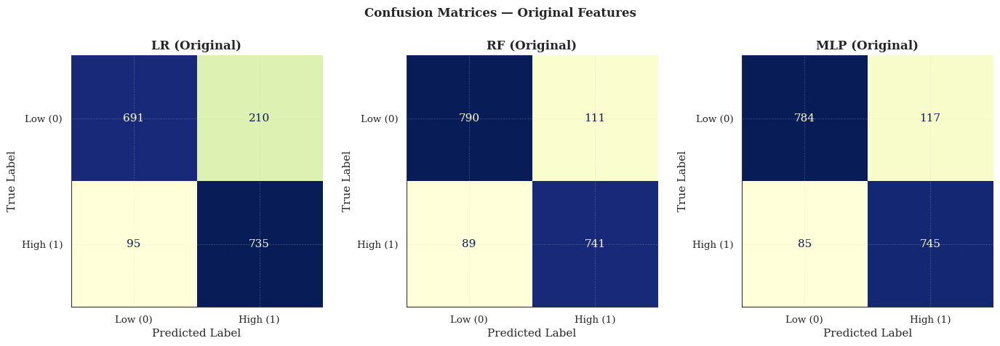

*Confusion_Matrix_Original.png*

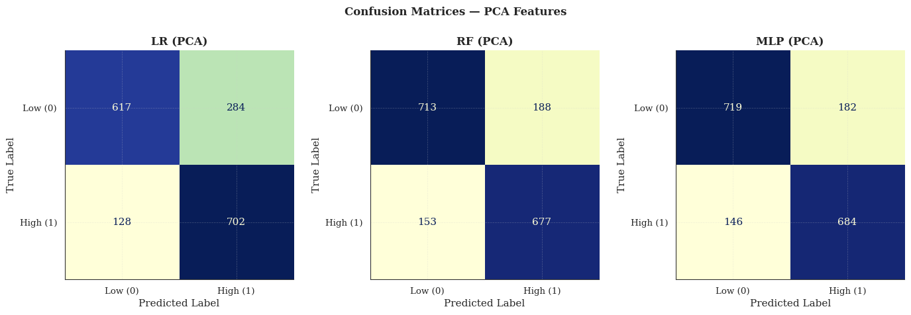

*Confusion_Matrix_PCA.png*

### ROC Curves

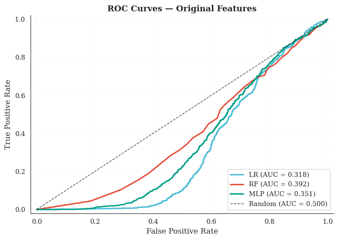

*ROC_Curve_Original.png*

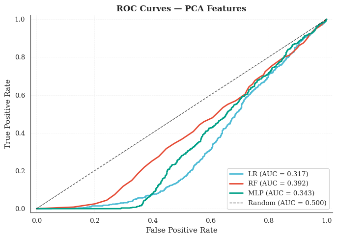

*ROC_Curve_PCA.png*

### Decision Boundaries on PC1-PC2 Plane

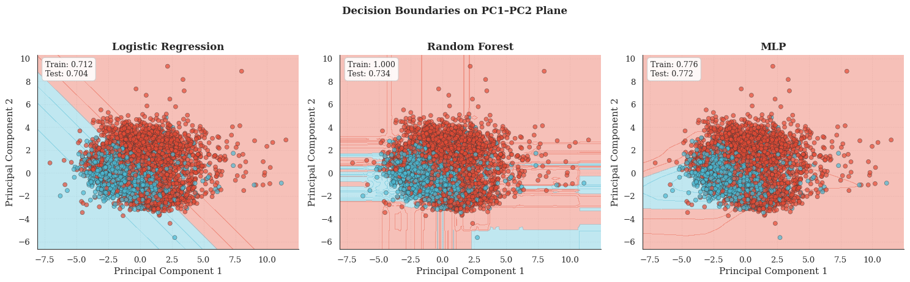

*Decision_Boundaries.png*

---

# Final Model Comparison Summary

**Test Set Performance**

| Model | Features | Accuracy | F1 | Precision | Recall | AUC |
| --- | --- | --- | --- | --- | --- | --- |
| **LR** | Original (12-D) | 0.7990 | 0.8069 | 0.7481 | 0.8757 | 0.3651 |
| **LR** | PCA (4 PCs) | 0.7540 | 0.7669 | 0.7028 | 0.8439 | 0.3323 |
| **RF** | Original (12-D) | 0.8773 | 0.8738 | 0.8622 | 0.8858 | 0.3984 |
| **RF** | PCA (4 PCs) | 0.8011 | 0.7949 | 0.7864 | 0.8035 | 0.4178 |
| **MLP** | Original (12-D) | **0.8926** | **0.8898** | 0.8755 | 0.9046 | 0.3784 |
| **MLP** | PCA (4 PCs) | 0.8129 | 0.8049 | 0.8049 | 0.8049 | 0.3608 |

<aside>

**Best Model:** MLP on Original (12-D) features
**F1 Score:** 0.8898 | **Accuracy:** 0.8926 | **AUC:** 0.3784

</aside>

---

# Feature Importance Analysis

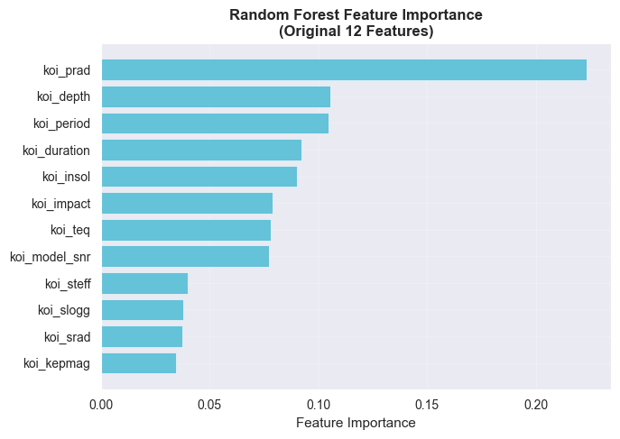

*RF_Feature_Importance_Original.png*

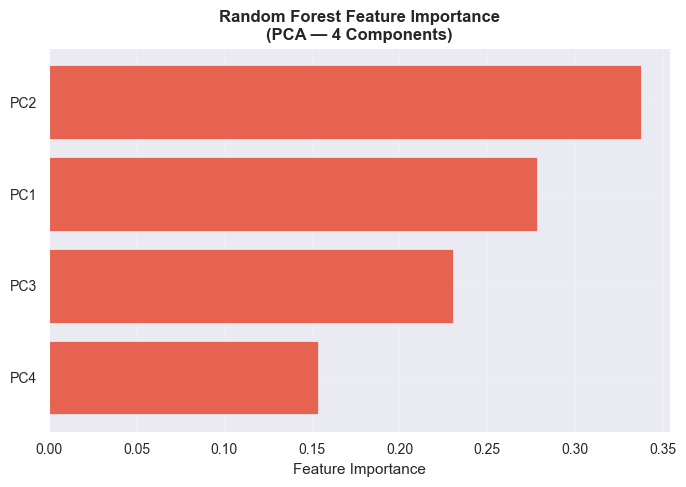

*RF_Feature_Importance_PCA.png*

### Top 5 Most Important Original Features

1. **koi_prad** — 0.2234
2. **koi_depth** — 0.1055
3. **koi_period** — 0.1045
4. **koi_duration** — 0.0921
5. **koi_insol** — 0.0902

### Top 3 Most Important Principal Components

1. **PC2** — 0.3375
2. **PC1** — 0.2784
3. **PC3** — 0.2303